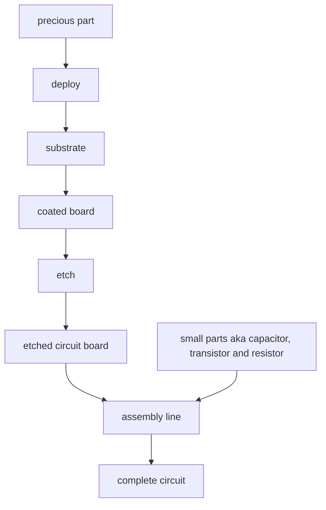

```mermaid
flowchart TD
	a[precious part] --> b[deploy] --> d[substrate] --> c[coated board] --> e[etch] --> f[etched circuit board] --> g[assembly line] --> h[complete circuit]
	
	i[small parts aka capacitor, transistor and resistor] --> g
	
```